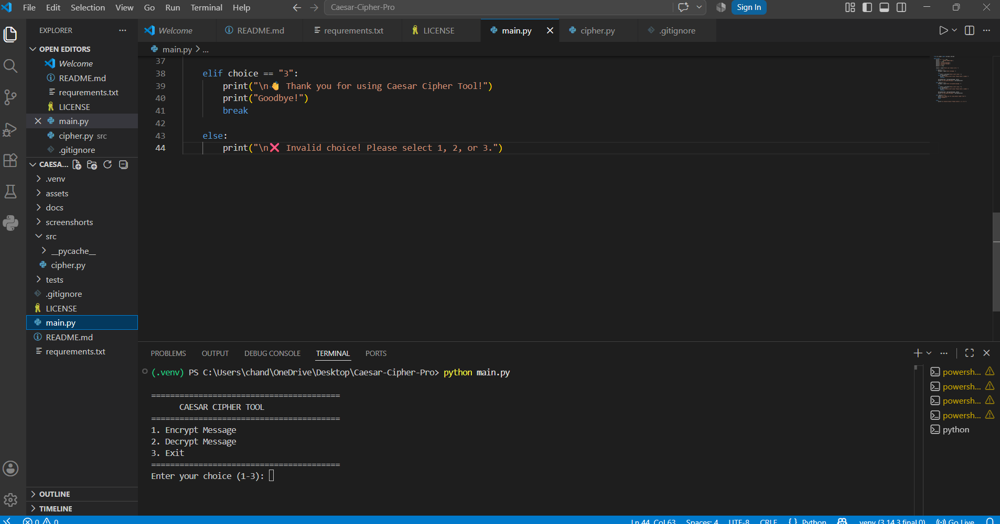
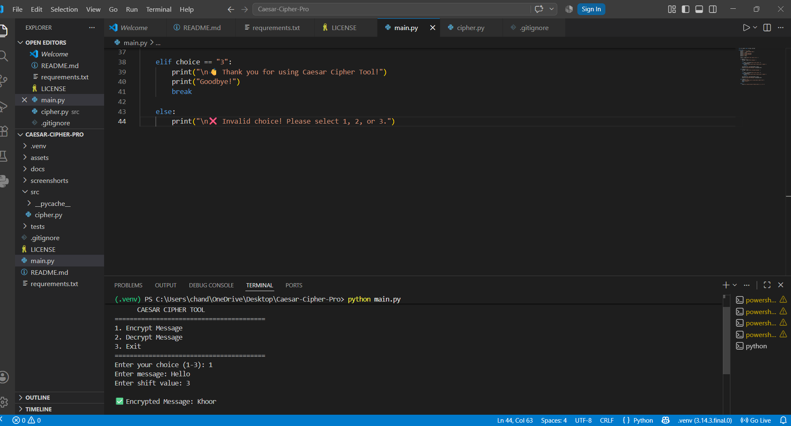
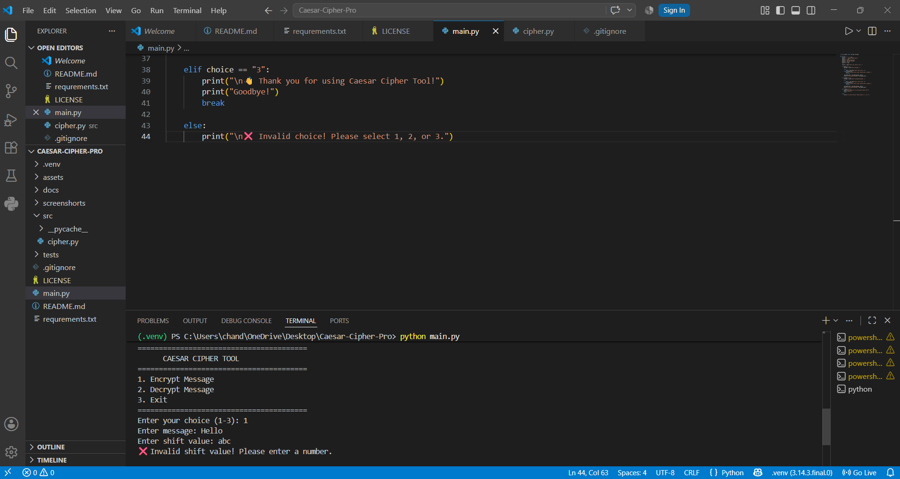

# Caesar Cipher Tool

## Project Description

This is a Python-based Caesar Cipher application that can encrypt and decrypt messages using the Caesar Cipher algorithm. The project is built with a modular structure and demonstrates Python fundamentals such as functions, loops, conditionals, string manipulation, exception handling, and user input.

## Features

- Encrypt messages
- Decrypt messages
- Supports uppercase letters
- Supports lowercase letters
- Preserves numbers and special characters
- Menu-driven interface
- Input validation using try-except
- Modular project structure

## Project Structure

CAESAR-CIPHER-PRO/
│
├── main.py
├── requirements.txt
├── README.md
├── LICENSE
├── .gitignore
├── src/
│   └── cipher.py
├── tests/
├── docs/
├── assets/
└── screenshots/

### Folder and File Description

- **main.py** - Main entry point of the application. Displays the menu and handles user interaction.
- **src/cipher.py** - Contains the Caesar Cipher encryption and decryption functions.
- **README.md** - Project documentation and usage instructions.
- **requirements.txt** - Lists the project dependencies (this project uses only the Python Standard Library).
- **LICENSE** - Specifies the license for the project.
- **.gitignore** - Tells Git which files and folders to ignore.
- **tests/** - Stores test files for the project.
- **docs/** - Contains additional project documentation.
- **assets/** - Stores project assets such as icons or other resources.
- **screenshots/** - Contains screenshots of the application for the README.


## Installation

1. Clone the repository:

```bash
git clone <repository-url>
```

2. Navigate to the project folder:

```bash
cd CAESAR-CIPHER-PRO
```

3. (Optional) Create a virtual environment:

```bash
python -m venv .venv
```

4. Activate the virtual environment.

**Windows**

```bash
.venv\Scripts\activate
```

**Linux/macOS**

```bash
source .venv/bin/activate
```

5. Install the required dependencies:

```bash
pip install -r requirements.txt
```

## How to Run

Run the following command:

```bash
python main.py
```


## Sample Output

### Main Menu



---

### Encryption



---

### Decryption


---

### Invalid Input Handling




## Technologies Used

- Python 3
- Visual Studio Code
- Git
- GitHub


## Future Improvements

- Add a graphical user interface (GUI).
- Support file encryption and decryption.
- Save encryption history.
- Add multiple cipher algorithms.
- Improve input validation and user experience.


## Author

**Name:** Dhanu Sri

**Course:** B.Tech (Computer Science and Machine Learning)

**Project:** Caesar Cipher Tool

**GitHub:** *(Add your GitHub profile link after creating your repository.)*


## License

This project is licensed under the MIT License. See the `LICENSE` file for more information.